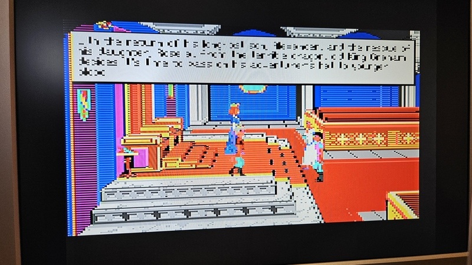
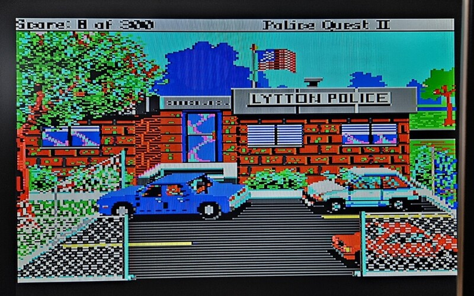
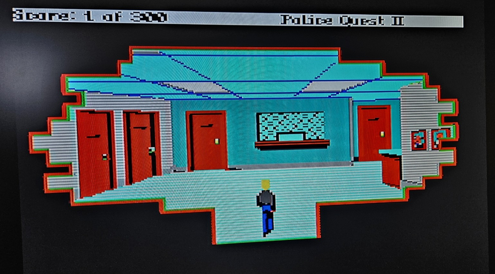

# Sierra SCI Drivers for Olivetti Prodest PC1

A complete archive of SCI 0 video driver development for the Olivetti Prodest PC1 with Yamaha V6355D LCDC (160×200×16 color, interlaced CGA memory layout). There is no mouse support, mostly because i don't have a mouse for the PC1, but also because the mouse routines would bloated the code.

## Overview

The **PC1.DRV** file series documents a complete optimization journey from a broken PCPLUS port through six variants (each teaching a lesson in failure) to a production-ready driver. Every version is fully functional enough to assemble and test on real hardware.

### 📥 [Download PC1.DRV — the only file you need to play SCI0 games on the PC1](PC1.DRV)

### Quick Start
- **Production driver:** `PC1-7.asm` → Generates `PC1.DRV`
- **Reference baseline:** `PC1-2.asm` (identical core algorithm, slightly different register allocation)
- **320×200 experiment:** `PC1-8.asm` → CGA mode with V6355D palette cycling (too slow for gameplay)
- **Educational variants:** `PC1-1` through `PC1-6` (each demonstrates an optimization failure)

## Screenshots

*SCI0 games running on the Olivetti Prodest PC1 with the PC1.DRV driver:*


<br><em>King's Quest 4 — SCI0 on Olivetti Prodest PC1</em>


<br><em>Police Quest 2 — SCI0 on Olivetti Prodest PC1</em>


<br><em>Police Quest 2 — SCI0 on Olivetti Prodest PC1</em>

---

## The Development Journey

### PC1-1.ASM — **Initial PCPLUS Port (BROKEN)**
**Status:** ✗ Graphics broken, keyboard broken, cursor code incomplete

**What went wrong:**
- Direct PCPLUS port didn't account for PC1's V6355D memory layout differences
- Attempted full mouse cursor support (bloated ~820 lines)
- Entry point uses simple `jmp dispatch` (violates SCI convention)
- Framebuffer conversion algorithm doesn't properly interleave rows

**What it teaches:**
- Not all CGA-compatible ports work without adaptation
- PC1 has unique timing and interrupt requirements
- Full feature sets (cursor support) can mask underlying bugs

**Key code smell:** Entry point doesn't use SCI's 3-byte opcode convention (`db 0E9h; dw ...`)

---

### PC1-1b.ASM — **Debugging Attempt (PARTIAL FIX)**
**Status:** ✗ Graphics fixed ✓, but keyboard broken ✗

**What went wrong:**
- Fixed entry point (`db 0E9h; dw dispatch - entry - 3`) made graphics work!
- But broke keyboard (suggests interrupt timing issue)
- Removed cursor support to simplify debugging
- Still failing despite smaller codebase (353 lines)

**What it teaches:**
- Entry point conventions matter (SCI uses 3-byte forced opcodes for reason)
- Fixing one issue can expose hidden interrupt/timing bugs
- Feature removal can simplify but doesn't guarantee correctness

**Progress:** 50% complete: graphics working, keyboard still broken

---

### PC1-2.ASM — **Working Baseline ✓ PRODUCTION**
**Status:** ✓ Full working driver (401 lines)

**What works:**
- Graphics rendering correct
- Keyboard responding properly  
- All functions implemented
- V40 optimization: 5-instruction inner loop
- Per-row interlace toggle for CGA memory interleave

**Key algorithm:**
```nasm
.x_loop:
    lodsw                   ; Load 2 pixels (4 color nibbles)
    and     al, 0xF0        ; Extract left pixel
    and     ah, 0xF0        ; Extract middle pixel (skip right)
    shr     ah, 4           ; Shift to low nibble
    or      al, ah          ; Combine: [left | middle]
    stosb                   ; Write downsampled byte
    loop    .x_loop
```

**Performance:** 
- 320×200 framebuffer → 160×200 screen
- Direct VRAM writes (3-transfer model on 8-bit bus)
- Per-row interlace overhead: 4 instructions/row
- **Result:** ~4-5 FPS on V40 @ 8MHz (acceptable for SCI)

**Why it works:**
- Respects SCI entry point convention
- Direct conversion (no buffering overhead)
- Alternating even/odd row writes maintain CGA interlace semantics
- CPU-optimized for narrow bus model

---

### PC1-3.asm — **Optimization Attempt #1: Ignore Rectangle (EDUCATIONAL FAILURE)**
**Status:** ✓ Runs, but slower than PC1-2

**What it does wrong:**
- Ignores `rect_top`, `rect_left`, `rect_bottom`, `rect_right` parameters
- Always copies **entire 200-row screen** even for small updates
- Wastes bus traffic on static regions

**Performance impact:**
- 200 rows instead of ~30-40 typical (SCI games only dirty ~15-20% of screen)
- **Result:** 2-3 FPS (worse than baseline)

**What it teaches:**
- Rectangle-aware updating is SCI's core value proposition
- CGA memory layout makes partial updates complex but necessary
- Ignoring parameters saves code but kills performance

**Lesson:** Rectangle awareness isn't optional optimization—it's architectural requirement.

---

### PC1-4.asm — **Optimization Attempt #2: Two-Pass Bank Separation (CREATES ARTIFACTS)**
**Status:** ✓ Runs, but **creates visible interlacing artifacts** ("combing" effect)

**What it tries to do:**
- Separate even/odd rows into two passes
- **Even pass:** Write all rows 0,2,4,...,198 sequentially to bank 0
- **Odd pass:** Write all rows 1,3,5,...,199 sequentially to bank 1

**Why it fails (the bug):**
```
CGA memory is interlaced:
    Bank 0: rows [0,2,4,...,198]   ← 160×100 pixel block @ 0xB000
    Bank 1: rows [1,3,5,...,199]   ← 160×100 pixel block @ 0xB000 + 0x2000

Per-row toggle REQUIRES interleaved writes:
    Write row 0 → bank 0
    Write row 1 → bank 1  ← NEXT write
    Write row 2 → bank 0  ← (DI resets to row 0 offset)
    Write row 3 → bank 1
    ...

PC1-4 does:
    Write rows [0,2,4,...,198] → bank 0  ← ALL EVEN ROWS AT ONCE
    Write rows [1,3,5,...,199] → bank 1  ← ALL ODD ROWS AT ONCE
    
Result: Temporal aliasing — even rows appear first, then odd rows update
        Creates "combing" scanline effect visible on-screen.
```

**What it teaches:**
- CGA interlace requires **interleaved writes** (per-row toggle), not sequential bulk transfers
- Optimization that violates hardware architecture creates visible artifacts
- "Optimization" that makes text harder to read is not optimization

**Key insight:** The per-row toggle in PC1-2 isn't overhead—**it's the correct algorithm**.

---

### PC1-5.asm — **Optimization Attempt #3: Line Buffer + rep movsw (SLOW)**
**Status:** ✓ Runs on hardware, but **hangs or very slow**

**What it tries to do:**
- 256-byte line buffer per row
- Convert 320-pixel row → 160-pixel buffer (slow)
- Use `rep movsw` blast buffer → VRAM (fast)

**Why it fails:**
- 4-transfer model: read FB, write buffer, read buffer, write VRAM
- V40's 8-bit bus can only hide 3-transfer latency
- Extra buffer read/write cycle = **stalls CPU waiting for memory**
- 256-byte buffer × 200 rows = massive extra bus traffic

**Bus model on V40/8-bit:**
```
3-transfer (optimal):  Latency hides in VRAM read (read → ALU → write)
4-transfer (fails):    Extra memory r/w = stall (read → wait → read → wait → write)
```

**What it teaches:**
- Buffering only wins for pure data copies (`rep movsw` on wide bus)
- Narrow 8-bit bus needs minimal transfers per operation
- Demo6's `rep movsw` is fast because framebuffer is **pre-converted** (not part of hot loop)

---

### PC1-6.asm — **Optimization Attempt #4: Full-Rectangle RAM Buffer (SLOWEST)**
**Status:** ✓ Runs on hardware, but **very slow or hangs**

**What it tries to do:**
- Allocate 8000-byte RAM buffer for entire rectangle
- Convert all pixels at once (full double-buffering)
- Then blast to VRAM in one pass

**Why it fails:**
- Same 4-transfer penalty as PC1-5, but **magnified**
- 8000 bytes × 2 (read + write) = 16000 bus operations per update
- Entire pipeline dedicated to buffer management

**What it teaches:**
- Double-buffering only helps if you can refill buffer faster than display (not on V40 @ 8MHz)
- Buffering strategies must match bus characteristics
- PC1-2's direct 3-transfer model is already optimal for the hardware

---

### PC1-7.asm — **Production Driver with Shake-Screen Support ✓ RECOMMENDED**
**Status:** ✓ Identical to PC1-2, but ready for Register 0x64 implementation

**Differences from PC1-2:**
- Inner loop uses BX as scratch register (more robust)
- Sound bug fixed (side effect of register stability)
- Comments document Register 0x64 shake_screen implementation (see below)

**New: Register 0x64 shake_screen**

The Yamaha V6355D supports vertical screen shake via register 0x64 bits 3-5:

```nasm
; Shake vertically by 4 rows, 10 times
mov al, 0x64
out 0xDD, al                ; Select register 0x64
jmp short $+2               ; I/O delay
mov al, (4 << 3) & 0x38     ; Position offset into bits 3-5
out 0xDE, al                ; Write to register
jmp short $+2
; ... repeat with offset=0 to restore ...
```

**Implementation TODOs in PC1-7.asm:**
- Loop on timer interrupt (cx = shake count)
- Toggle offset between 0 and 4 each iteration
- Restore to 0 at end

See `PC1-OPTIMIZATION-ANALYSIS.md` for complete implementation template.

---

### PC1-8.ASM — **320×200 CGA with V6355D Palette Adaptation (EXPERIMENTAL)**
**Status:** ✗ Functional but impractical — too slow for interactive gameplay

**Concept:**
Renders SCI's 16-color EGA framebuffer at full 320×200 horizontal resolution using CGA mode 4 (2bpp). The Yamaha V6355D DAC is reprogrammed with the 3 most-used non-black colors from the current scene, overriding CGA's fixed cyan/magenta/white palette.

**Why CGA palette flipping doesn't work on V6355D:**

The V6355D maps CGA pixel values 0-3 to DAC entries depending on which BIOS palette and intensity is active (e.g., palette 1 high → entries 0, 11, 13, 15). Changing these colors requires writing all 16 DAC entries (32 bytes) — fast at ~100µs. But the real problem is **synchronization**: after reprogramming the DAC, the CGA pixel values already in VRAM were written with the old color mapping. A full-screen redraw (32KB read + 16KB write) is needed, taking ~200ms on the V40's 8-bit bus. There's no way to trigger a redraw from inside the SCI driver API — the engine controls when `update_rect` is called.

**What was tried:**
1. **Per-scanline palette streaming** (PC1-BMP3 technique) → Each `update_rect` blocked 16ms for VSYNC sync. SCI calls it dozens of times per frame → minutes to draw one screen.
2. **On-the-fly palette build** → 68µs per scanline exceeded the ~52µs active display. Only 2 lines visible.
3. **Global palette in update_rect** → Small rectangles (cursor, text) kept overriding the full-scene palette with wrong colors.
4. **Palette analysis in show_cursor** → Not called during loading. Screen stayed black for minutes.
5. **Keypress-triggered update** (final version) → Works for testing. Pressing space scans framebuffer, reprograms V6355D, and redraws. But proves the core issue: the 320×200 conversion pipeline is simply too slow for interactive SCI games on V40 @ 8MHz.

**Key technical insights:**
- CGA mode 4 uses DAC entries 0/3/5/7 (palette 1 low) and 0/11/13/15 (palette 1 high) — not consecutive entries. Custom colors must be written to ALL mapping positions (per PC1PAL.asm technique).
- `cs xlatb` segment override enables reading the lookup table from CS while `lodsw` reads framebuffer from DS — eliminates the need for an intermediate row buffer.
- The V6355D palette write sequence requires I/O delays (`jmp short $+2`) between port writes.

**Why development stopped:**
The SCI0 games are too slow to be playable on the Olivetti PC1 at 320×200. The V40 CPU at 8MHz with an 8-bit bus cannot convert 32KB of EGA framebuffer per frame fast enough. The 160×200 PC1-7 driver provides acceptable frame rates, and the palette technique works well for static images (PC1-BMP3). For interactive games, the hardware simply isn't fast enough.

**Files:**
- `PC1-8.asm` — Clean rewrite with keypress-triggered palette update (1757 bytes)
- `PC1-8-streaming.asm` — Archived earlier version with per-scanline streaming attempts

---

## Performance Comparison

| Driver | Purpose | Rows/Update | FPS @ V40 | Notes |
|--------|---------|-------------|----------|-------|
| **PC1-2** | Baseline | ~30-40 (rect) | 4-5 FPS | ✓ Reference implementation |
| **PC1-7** | Production | ~30-40 (rect) | 4-5 FPS | ✓ Ready for shake_screen |
| **PC1-8** | 320×200 + palette | 200 (full) | ~1-2 FPS | ✗ Experimental, too slow |
| PC1-1 | Prototype | N/A (broken) | — | ✗ Graphics broken |
| PC1-1b | Debug | N/A (broken) | — | ✗ Keyboard broken |
| PC1-3 | Full-screen | 200 | 2-3 FPS | ✗ Ignores rect params |
| PC1-4 | Two-pass | ~30-40 | ~3 FPS | ✗ Interlacing artifacts |
| PC1-5 | Buffered | ~30-40 | 1-2 FPS | ✗ 4-transfer stall |
| PC1-6 | Double-buff | ~30-40 | <1 FPS | ✗ Maximum overhead |

---

## How to Use

### Assemble
```bash
nasm -f bin PC1-7.asm -o PC1.DRV
```

### Copy to Bootable Media
```bash
copy PC1.DRV a:\PC1.DRV    (on Windows)
cp PC1.DRV /mnt/floppy/    (on Linux)
```

### Test on PC1 Hardware
1. Boot PC1 into DOS from floppy
2. Sierra SCI game automatically loads PC1.DRV
3. Look for:
   - Correct graphics rendering (no "combing")
   - Responsive keyboard input
   - Proper sound playback

---

## Architecture Reference

### Hardware Context
- **CPU:** NEC V40 @ 8 MHz (80186 compatible)
- **Display:** Yamaha V6355D LCDC
- **Resolution:** 160×200 pixels, 16 colors
- **VRAM:** 16 KB @ B000:0000
- **Memory layout:** CGA-interlaced (even rows in bank 0, odd rows in bank 1)

### CGA Interlace Memory Map
```
Bank 0 (offset +0):      Bank 1 (offset +2000h):
  Row 0 (160 bytes)        Row 1 (160 bytes)
  Row 2 (160 bytes)        Row 3 (160 bytes)
  ...                      ...
  Row 198 (160 bytes)      Row 199 (160 bytes)
```

Updating requires per-row toggle:
- Write row 0 to bank 0 (DI = 0)
- Write row 1 to bank 1 (DI = 0x2000)
- Write row 2 to bank 0 (DI = 160, then reset on row boundary)
- Write row 3 to bank 1 (DI = 0x2000 + 160, etc.)

### Framebuffer Format
- SCI framebuffer: 320×200, 2 pixels per byte (packed 4-bit nibbles)
- PC1 VRAM: 160×200, 2 pixels per byte (packed 4-bit nibbles, right-pixel downsampled)
- Conversion: Take left pixel only (high nibble) from each 2-pixel pair

---

## Development Progression Summary

```
PC1-1 (broken) → PC1-1b (partially fixed) → PC1-2 (working!)
                                           ↓
                    +--------- PC1-3 (full-screen, slower)
                    ├─ PC1-4 (two-pass, artifacts)
                    ├─ PC1-5 (buffered, stalls)
                    └─ PC1-6 (double-buff, very slow)
                    
                    All 6 variants remain working for education
                    PC1-2 = reference implementation
                    PC1-7 = production (PC1-2 + bug fixes + shake support)

                    PC1-8 = 320×200 CGA palette experiment (too slow)
                    PC1-8-streaming = archived per-scanline streaming attempt
```

Every variant works enough to run and visually demonstrate **why** it failed. PC1-2 and PC1-7 are the only ones you'd ship; the others are teaching material.

---

## Key Insights for Optimization

1. **Rectangle awareness is non-negotiable** (PC1-3 lesson)
   - SCI expects partial updates to save bandwidth
   - Full-screen updates waste 80% of bus traffic
   
2. **Interlace order matters** (PC1-4 lesson)
   - CGA memory structure isn't just "rows" — it's interleaved even/odd
   - Sequential per-bank passes create visible temporal aliasing
   - Per-row toggle is the architectural requirement, not optional overhead

3. **Buffering defeats narrow buses** (PC1-5, PC1-6 lessons)
   - V40's 8-bit bus can hide 3-transfer latency (read→ALU→write)
   - 4-transfer buffering adds stall cycles
   - Direct conversion is optimal on V40/CGA architecture

4. **Hardware conventions matter** (PC1-1, PC1-1b lessons)
   - SCI entry point format (3-byte opcode) is non-optional
   - Simple `jmp dispatch` breaks keyboard/interrupt timing
   - Port from one CPU/display needs careful adaptation

5. **CPU-specific optimization wins** (PC1-2 success)
   - `lodsw` + `and` + `shr` + `or` + `stosb` hides VRAM latency
   - 5-instruction core is optimal for 8-bit bus model
   - Demo6's `rep movsw` would fail here (requires pre-conversion)

---

## References

- **OPTIMIZATION-ANALYSIS.md:** Deep dive into Register 0x64 shake_screen, scroll_rect semantics, performance analysis
- **V6355D_scroll_test.asm:** Reference hardware test for Register 0x64 writes (in Demo Scene/)
- **Demo6.asm:** Reference for `rep movsw` optimization (only works with pre-converted buffers)
- **PCPLUS.DRV:** Original PCPLUS driver (basis for ports, in reference repos)

---

## License

These drivers are published under the GNU LGPL license, following the original PCPLUS.DRV by Benedikt Freisen.

---

## YouTube

For more retro computing content, visit my YouTube channel **Retro Hardware and Software**:
[https://www.youtube.com/@RetroErik](https://www.youtube.com/@RetroErik)
